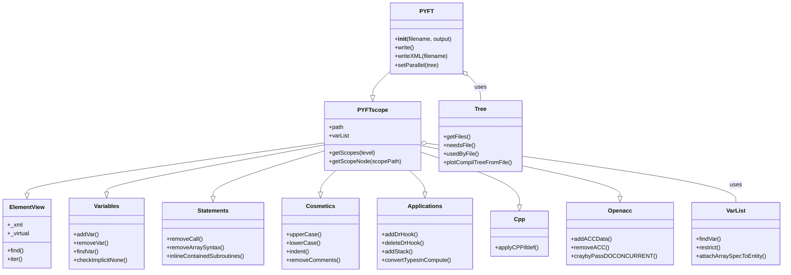

# Architecture Guide

This document describes the architecture of PyForTool to help developers understand the codebase and maintain the project.

## Overview

PyForTool is a Python package for source-to-source transformation of FORTRAN code. It uses [fxtran](https://github.com/fxcoudert/fxtran) to parse FORTRAN into XML, then manipulates the XML tree, and finally converts back to FORTRAN.

```
┌─────────────────────────────────────────────────────────────────┐
│                         FORTRAN Source                          │
│                           input.F90                             │
└─────────────────────────┬───────────────────────────────────────┘
                          │
                          ▼
┌─────────────────────────────────────────────────────────────────┐
│                    fxtran Parser                                │
│              (FORTRAN → XML conversion)                         │
└─────────────────────────┬───────────────────────────────────────┘
                          │
                          ▼
┌─────────────────────────────────────────────────────────────────┐
│                      XML Tree                                   │
│             (Manipulated by PyForTool)                          │
└─────────────────────────┬───────────────────────────────────────┘
                          │
                          ▼
┌─────────────────────────────────────────────────────────────────┐
│                   tofortran()                                   │
│              (XML → FORTRAN conversion)                         │
└─────────────────────────┬───────────────────────────────────────┘
                          │
                          ▼
┌─────────────────────────────────────────────────────────────────┐
│                         FORTRAN Output                          │
│                          output.F90                             │
└─────────────────────────────────────────────────────────────────┘
```

## Class Hierarchy

The class structure uses Python's mixin pattern to separate concerns:

```
┌─────────────────────────────────────────────────────────────────┐
│                       PYFT (pyfortool.py)                       │
│                   File-level operations                         │
│              read/write, parallel processing                    │
└─────────────────────────┬───────────────────────────────────────┘
                          │ extends
                          ▼
┌─────────────────────────────────────────────────────────────────┐
│                    PYFTscope (scope.py)                         │
│             Scope-level operations                              │
│   ┌─────────────────────────────────────────────────────────┐   │
│   │      PYFTscope(ElementView, Variables, Cosmetics,       │   │
│   │                Applications, Statements, Cpp, Openacc)  │   │
│   └─────────────────────────────────────────────────────────┘   │
└─────────────────────────────────────────────────────────────────┘

                              │
        ┌─────────────────────┼─────────────────────┐
        │                     │                     │
        ▼                     ▼                     ▼
┌───────────────┐   ┌───────────────┐   ┌───────────────┐
│ ElementView   │   │  Variables    │   │  Cosmetics    │
│ (scope.py)    │   │ (variables.py)│   │(cosmetics.py) │
│ XML wrapper   │   │ VarList, add/ │   │ case, indent  │
│ contains      │   │ remove vars   │   │ spacing       │
└───────────────┘   └───────────────┘   └───────────────┘

        ┌─────────────────────┼─────────────────────┐
        │                     │                     │
        ▼                     ▼                     ▼
┌───────────────┐   ┌───────────────┐   ┌───────────────┐
│ Applications  │   │  Statements   │   │    Cpp        │
│(applications) │   │(statements.py │   │   (cpp.py)    │
│ DR_HOOK, GPU  │   │ CALL, arrays  │   │ #ifdef, #if   │
│               │   │ inlining      │   │ directives    │
└───────────────┘   └───────────────┘   └───────────────┘
                                                         │
                                                         ▼
                                              ┌───────────────┐
                                              │   Openacc     │
                                              │  (openacc.py) │
                                              │ !$acc, GPU    │
                                              └───────────────┘
```

## Key Components

### PYFT (pyfortool.py)

Main entry point for file-level operations.

```python
from pyfortool import PYFT

# Read, transform, write
pft = PYFT('input.F90')
pft.upperCase()
pft.write()

# Use context manager
with PYFT('input.F90', output='output.F90') as pft:
    pft.removeComments()
    pft.write()
```

**Key Features:**
- File I/O operations
- Parallel processing support via `setParallel()`
- Integrates with Tree for cross-file analysis

### PYFTscope (scope.py)

Represents a FORTRAN scope (module, subroutine, function, type).

```python
# Get all scopes in a file
pft = PYFT('input.F90')
scopes = pft.getScopes()

# Get specific scope by path
sub = pft.getScopeNode('module:MOD/sub:SUB')

# Navigate to parent/child scopes
parent = sub.parentScope
children = sub.getScopes(level=1)
```

### VarList (variables.py)

Stores variable characteristics for each scope.

```python
# Query variables
vl = pft.varList
var = vl.findVar('X')  # Find variable X
vl.findVar('Y', array=True)  # Find only arrays

# Access variable properties
var['n']   # name: 'X'
var['t']   # type: 'REAL'
var['as']  # array specs: [(None, '10')]
var['i']   # intent: 'IN'
var['arg'] # is dummy argument: True
```

### Tree (tree.py)

Cross-file dependency tracking.

```python
from pyfortool.tree import Tree

tree = Tree(['/path/to/src'], descTreeFile='tree.json')

# Query dependencies
deps = tree.needsFile('file.F90')      # What this file needs
users = tree.usedByFile('file.F90')   # What needs this file

# Visualization
tree.plotCompilTreeFromFile('main.F90', 'deps.dot')
tree.plotExecTreeFromFile('main.F90', 'calls.dot')
```

## Decorator System

PyForTool uses decorators for cross-cutting concerns:

| Decorator | Purpose | File |
|-----------|---------|------|
| `@debugDecor` | Tracing and profiling | `util.py` |
| `@updateVarList` | Invalidate variable cache | `variables.py` |
| `@updateTree` | Update dependency tree | `tree.py` |
| `@noParallel` | Prevent parallel execution | `util.py` |

### @debugDecor

Traces function calls with timing and argument logging.

```python
# Log level determines verbosity
# WARNING: Minimal overhead
# INFO: Shows call count and execution time
# DEBUG: Shows arguments and return values
```

### @updateVarList

Must be applied to methods that modify declarations.

```python
@debugDecor
@updateVarList
def addVar(self, varList):
    # Modify variables...
    pass
    # Decorator invalidates self.mainScope._varList
```

### @updateTree

Updates cross-file dependencies after modifications.

```python
@updateTree('file')     # Analyze current file
@updateTree('scan')    # Look for new/removed files
@updateTree('signal')  # Analyze signaled files
```

### @noParallel

Prevents concurrent execution for XML-modifying methods.

```python
# Must appear BEFORE @updateTree
@noParallel
@updateTree('signal')
def someModifyingMethod(self):
    pass
```

## Data Flow

```
                    ┌──────────────┐
                    │   User Code  │
                    └──────┬───────┘
                           │
                           ▼
┌────────────────────────────────────────────────────────────┐
│                     PYFT.__init__()                        │
│  1. fortran2xml() parses FORTRAN → XML                     │
│  2. Tree is created/updated                                │
│  3. VarList is initially empty (lazy computation)          │
└──────────────────────────┬─────────────────────────────────┘
                           │
                           ▼
┌────────────────────────────────────────────────────────────┐
│                     Method Calls                           │
│  e.g., pft.removeCall('FOO'), pft.addVar([...])            │
└──────────────────────────┬─────────────────────────────────┘
                           │
                    ┌──────┴───────┐
                    │  Decorators  │
                    └──────┬───────┘
                           │
              ┌────────────┼────────────┐
              ▼            ▼            ▼
         ┌────────┐  ┌─────────┐  ┌────────┐
         │ Modify │  │ @update │  │@noParal│
         │  XML   │  │VarList  │  │  lel   │
         └────────┘  └─────────┘  └────────┘
                           │
                           ▼
┌──────────────────────────────────────────────────────────────┐
│                       pft.write()                            │
│  1. tofortran() converts XML → FORTRAN                       │
│  2. Write to output file                                     │
└──────────────────────────────────────────────────────────────┘
```

## Adding New Methods

### Step 1: Choose the Right Module

| Module | Purpose | Examples |
|--------|---------|----------|
| `variables.py` | Variable declarations | `addVar`, `removeVar`, `findVar` |
| `statements.py` | Statement manipulation | `removeCall`, `removeArraySyntax`, `inline` |
| `cosmetics.py` | Code formatting | `upperCase`, `indent`, `removeComments` |
| `applications.py` | High-level transforms | `addDrHook`, `addStack`, `convertTypesInCompute` |
| `cpp.py` | Preprocessor | `applyCPPifdef` |
| `openacc.py` | GPU directives | `addACCData`, `removeACC` |

### Step 2: Apply Decorators

```python
# Add to appropriate class
class Variables:
    @debugDecor
    @noParallel           # If modifies XML structure
    @updateVarList        # If changes variables
    @updateTree('signal') # If affects dependencies
    def myNewMethod(self, arg1, arg2):
        """
        Brief description.

        Detailed description of what this method does.

        Parameters
        ----------
        arg1 : type
            Description of arg1.
        arg2 : type
            Description of arg2.

        Examples
        --------
        >>> pft = PYFT('input.F90')
        >>> pft.myNewMethod(x, y)
        """
        # Implementation
        pass
```

### Step 3: Follow Coding Standards

```bash
# Run linting before committing
flake8 src/pyfortool/

pylint -d R0912,C0209,R0915,R1702,C0302,R0913,R0914,W1202,R0904,R0902 \
    src/pyfortool/
```

## Architecture Diagram (Mermaid)

For the rendered image version, see [architecture.svg](architecture.svg):



## Testing

PyForTool uses pytest for unit testing. See [Testing Guide](testing.html) for details.

### Running Tests

```bash
# Unit tests (pytest)
PYTHONPATH=src pytest tests/ -v

# Non-regression tests
cd examples && ./tests.sh

# With coverage
PYTHONPATH=src pytest tests/ --cov=pyfortool --cov-report=html
```

### CI/CD

Tests run automatically via GitHub Actions:

| Job | Tests | Python |
|-----|-------|--------|
| `pytest` | Unit tests | 3.9, 3.10, 3.11, 3.12 |
| `regression` | Non-regression (examples/) | 3.11 |
| `lint` | flake8 | 3.11 |

### Test Structure

```
tests/
├── conftest.py           # Shared fixtures
├── test_pyft.py          # PYFT class tests
├── test_scope.py         # PYFTscope tests
├── test_varList.py       # VarList tests
├── test_variables.py     # Variables mixin tests
├── test_statements.py    # Statements mixin tests
├── test_cosmetics.py     # Cosmetics mixin tests
├── test_cpp.py          # Cpp mixin tests
├── test_openacc.py       # Openacc mixin tests
├── test_applications.py  # Applications mixin tests
└── test_helpers/
    ├── test_util.py      # Utility function tests
    └── test_expressions.py # Expression helper tests
```

## See Also

- [Core Concepts](md__home_sriette_GIT_pyfortool_doc_developer_concepts.html) - Detailed explanation of scope paths, VarList, and decorators
- [Module Organization](md__home_sriette_GIT_pyfortool_doc_developer_modules.html) - What each module contains
- [Testing Guide](md__home_sriette_GIT_pyfortool_CONTRIBUTING.html#testing) - How to run and add tests
- [User's Guide](../Documentation.html) - End-user documentation
- [API Reference](../html/index.html) - Auto-generated from docstrings
